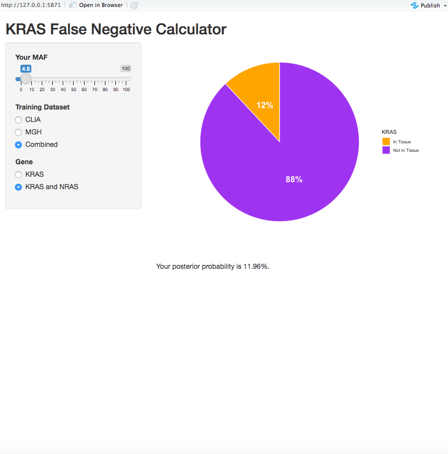
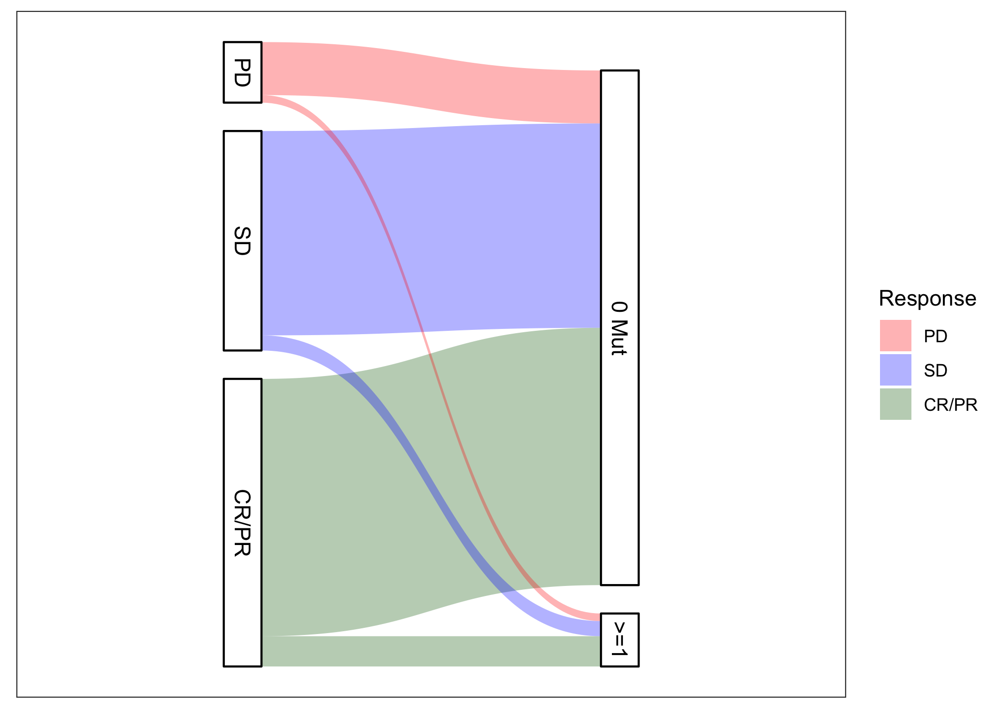

## Overview
The MD Anderson SPORE in Gastrointestinal Cancer is actively challenging our basic science and 
clinical investigators to identify and implement leading-edge research that realizes translational impact. 
The SPORE PIs are Scott Kopetz, MD, PhD and Anirban Maitra, MD. 

The Biostatistics Core is led by Ying Yuan, PhD and Ryan Sun, PhD.
Here we collect some of the ctDNA-focused tools that have been developed in service of the SPORE research.
We hope these tools are of interest to the broader cancer research community. 
Please feel to contact Core investigators for more information.

We gratefully acknowledge the support of NCI grant P30CA016672. 
For more information, please see the public SPORE [website](https://trp.cancer.gov/spores/abstracts/mdanderson_gi.htm).

#### [KRAS False Negatives](https://www.github.com/ryanrsun/kras_calculator)

The KRAS false negative calculator is an R Shiny app designed to calculate that a negative KRAS mutation finding
in ctDNA is actually a false negative. 
It is known that ctDNA assays do not detect mutations with 100% accuracy. 
For example, sometimes the level of a mutation can fall below the assay's limit of detection.
Because colorectal cancer treatment plans depend critically on the presence or absence of KRAS
mutations, it is important to further estimate a level of confidence in the KRAS finding from ctDNA.
The KRAS false negative calculator provides that additional information.

---

#### [Interval-Censored Sequence Kernel Association Test](https://www.github.com/ryanrsun/ICSKAT)

It is often of interest to associate mutations with a time-to-event outcome, e.g. progression-free survival.
In oncology studies, these outcomes are often interval-censored (for instance, the exact date of progression
is generally not known, we may only know that the subject progressed in-between their last two imaging visits).
Testing single mutations against interval-censored event times is generally an underpowered analysis.
This is because the mutations are often rare (only one or two people may possess any given mutation), there
is a large multiple testing burden, and the effects of a single mutation may be weak.
We introduce the Interval-Censored Sequence Kernel Association Test (ICSKAT), which can be used to test the 
association between event times and a group of mutations, e.g. all mutations in a gene or pathway. 
This more powerful strategy allows for aggregation of mutations into a sensible and interpretable biological construct
while aggregating signals and lowering the multiple testing burden.

---

#### [EGFR Rechallenge Data Analysis](https://www.github.com/ryanrsun/resistance_anti_egfr) 

We analyzed ctDNA profiles in first-line and third-line anti-EGFR therapy for subjects with colorectal cancer.
The manuscript describing our results will be forthcoming shortly.
The code used for analysis can be found in this repository.

